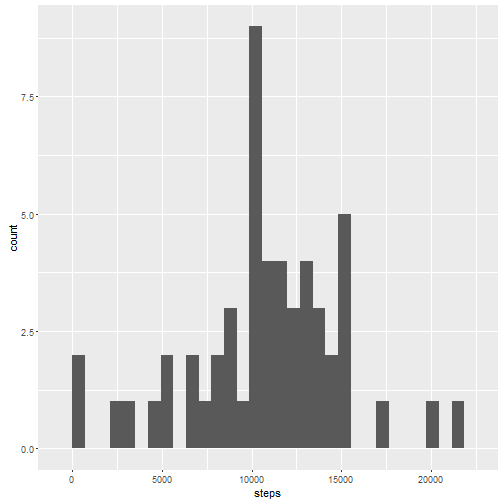
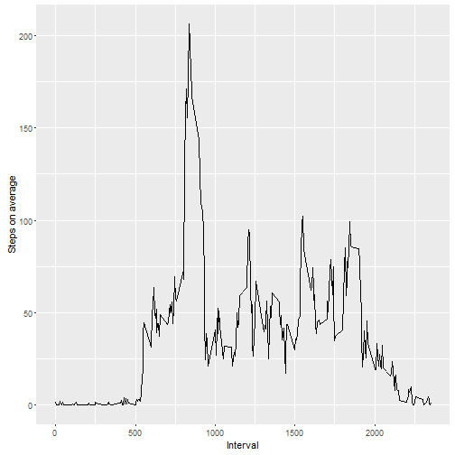
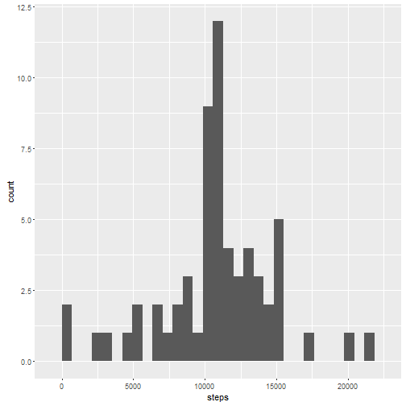
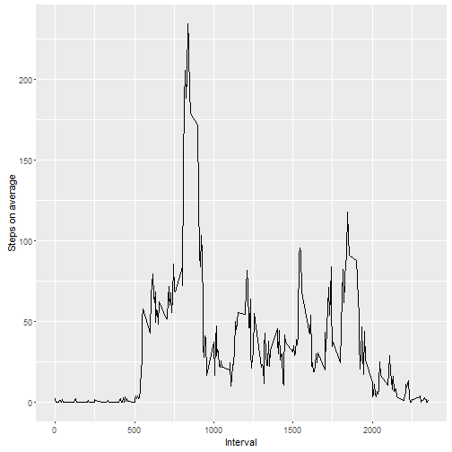
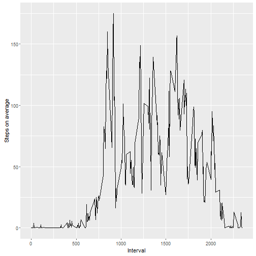

### Packages loaded for this analysis


```r
library(knitr)
opts_chunk$set(echo = TRUE)
library(lubridate)
library(ggplot2)
```


### Loading and preprocessing the data

I loaded the data in the "acttivity" file using the following command:


```r
data <- read.csv("activity.csv", colClasses = c("numeric", "character", "integer"))
```


### What is mean total number of steps taken per day?

For this part of the assignment, I will ignore the missing values in the dataset.


```r
data2 <- na.omit(data)
```

"data2" is just the data frame "data" without the missing values

#### Total number of steps taken per day


```r
activity <- aggregate(data2$steps, list(data2$date), sum)
colnames(activity) <- c("date", "steps")
activity
```

```
##          date steps
## 1  2012-10-02   126
## 2  2012-10-03 11352
## 3  2012-10-04 12116
## 4  2012-10-05 13294
## 5  2012-10-06 15420
## 6  2012-10-07 11015
## 7  2012-10-09 12811
## 8  2012-10-10  9900
## 9  2012-10-11 10304
## 10 2012-10-12 17382
## 11 2012-10-13 12426
## 12 2012-10-14 15098
## 13 2012-10-15 10139
## 14 2012-10-16 15084
## 15 2012-10-17 13452
## 16 2012-10-18 10056
## 17 2012-10-19 11829
## 18 2012-10-20 10395
## 19 2012-10-21  8821
## 20 2012-10-22 13460
## 21 2012-10-23  8918
## 22 2012-10-24  8355
## 23 2012-10-25  2492
## 24 2012-10-26  6778
## 25 2012-10-27 10119
## 26 2012-10-28 11458
## 27 2012-10-29  5018
## 28 2012-10-30  9819
## 29 2012-10-31 15414
## 30 2012-11-02 10600
## 31 2012-11-03 10571
## 32 2012-11-05 10439
## 33 2012-11-06  8334
## 34 2012-11-07 12883
## 35 2012-11-08  3219
## 36 2012-11-11 12608
## 37 2012-11-12 10765
## 38 2012-11-13  7336
## 39 2012-11-15    41
## 40 2012-11-16  5441
## 41 2012-11-17 14339
## 42 2012-11-18 15110
## 43 2012-11-19  8841
## 44 2012-11-20  4472
## 45 2012-11-21 12787
## 46 2012-11-22 20427
## 47 2012-11-23 21194
## 48 2012-11-24 14478
## 49 2012-11-25 11834
## 50 2012-11-26 11162
## 51 2012-11-27 13646
## 52 2012-11-28 10183
## 53 2012-11-29  7047
```

#### ggplot2 was used for the histogram of steps per day


```r
qplot(activity$steps, geom = "histogram", xlab = "steps")
```

```
## `stat_bin()` using `bins = 30`. Pick better value with `binwidth`.
```



####  Mean and median of the total number of steps taken per day


```r
mean(activity$steps)
```

```
## [1] 10766.19
```

```r
median(activity$steps)
```

```
## [1] 10765
```


### What is the average daily activity pattern?

####  Time series plot of the 5-minute interval (x-axis) and the average number of steps taken, averaged across all days (y-axis)

First, we calculate the average number of steps taken across all days


```r
daily <- aggregate(data2$steps, list(data2$interval), mean)
```

Time series plot:


```r
qplot(daily[,1], daily[,2], geom = "line", xlab = c("Interval"), ylab = c("Steps on average"))
```



####  Which 5-minute interval, on average across all the days in the dataset, contains the maximum number of steps?


```r
m <- max(daily$x)
subset(daily, x==m)
```

```
##     Group.1        x
## 104     835 206.1698
```

Interval 835 has the maximum number of steps with 206 steps


### Imputing missing values

#### Total number of missing values in the dataset (i.e. the total number of rows with NAs)


```r
sum(is.na(data$steps))
```

```
## [1] 2304
```

There are 2304 missing values

#### Strategy for missing values

We shall replace the missing values with the mean for that 5-minute interval


```r
data3 <- data
na <- is.na(data3$steps)
daily2 <- tapply(data3$steps, data3$interval, mean, na.rm=TRUE)
data3$steps[na] <- daily2[as.character(data3$interval[na])]
head(data3)
```

```
##       steps       date interval
## 1 1.7169811 2012-10-01        0
## 2 0.3396226 2012-10-01        5
## 3 0.1320755 2012-10-01       10
## 4 0.1509434 2012-10-01       15
## 5 0.0754717 2012-10-01       20
## 6 2.0943396 2012-10-01       25
```

There are no missing values anymore


```r
sum(is.na(data3$steps))
```

```
## [1] 0
```

#### Total number of steps taken per day on new data set


```r
activity2 <- aggregate(data3$steps, list(data3$date), sum)
colnames(activity2) <- c("date", "steps")
```

#### ggplot2 was used again for the histogram of steps per day


```r
qplot(activity2$steps, geom = "histogram", xlab = "steps")
```

```
## `stat_bin()` using `bins = 30`. Pick better value with `binwidth`.
```



#### Mean and median of the total number of steps taken per day


```r
mean(activity2$steps)
```

```
## [1] 10766.19
```

```r
median(activity2$steps)
```

```
## [1] 10766.19
```

Now both the mean and the median are equal to the same value: 10766


### Are there differences in activity patterns between weekdays and weekends?

First, we transform the date column in "data2" into dateformat 


```r
data2$date <- ymd(data2$date)
```

Now we create a factor with the weekday and weekends


```r
weekdays <- c('Monday', 'Tuesday', 'Wednesday', 'Thursday', 'Friday')
wfactor <- factor((weekdays(data2$date) %in% weekdays), levels=c(FALSE, TRUE), labels=c('weekend', 'weekday'))
```

Then, the data frame containing the weekdays can be created


```r
data4 <- cbind(data2,wfactor)
```

Time series plot of the 5-minute interval and the average number of steps taken, averaged across all weekday days 


```r
data5 <- subset(data4, wfactor == "weekday")
daily3 <- aggregate(data5$steps, list(data5$interval), mean)
qplot(daily3[,1], daily3[,2], geom = "line", xlab = c("Interval"), ylab = c("Steps on average"))
```



Time series plot of the 5-minute interval and the average number of steps taken, averaged across all weekends 


```r
data6 <- subset(data4, wfactor == "weekend")
daily4 <- aggregate(data6$steps, list(data6$interval), mean)
qplot(daily4[,1], daily4[,2], geom = "line", xlab = c("Interval"), ylab = c("Steps on average"))
```



Examining those tow plots one can say that the person is more active earlier in the day during weekdays compared to weekends, also more active during the weekends compared with weekdays


